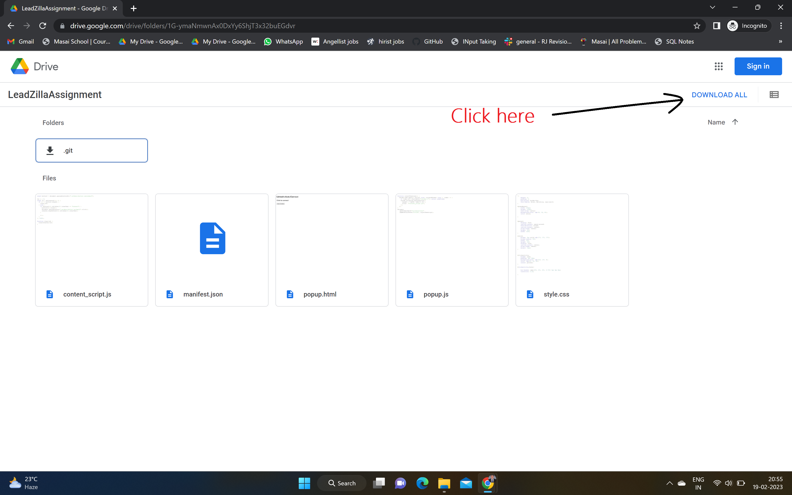

<h1>Auto Connect Chrome Extension</h1>

<h2>Instruction how to use this extension</h2>

<b>Step-1</b>
<a src = "https://drive.google.com/drive/folders/1G-ymaNmwnAx0DxYy6ShjT3x32buEGdvr?usp=share_link">Click Here to download Extension</a>

 

<b>Step-2</b>

Extract the zip file and you will get the folder name as LeadZillaAssignment.

<b>Step-3</b>

Open Google Chrome and the below steps from Image.

 
 

 

 

<h2>That's it now you can find this extension in your extension icons button. Thank You</h2>